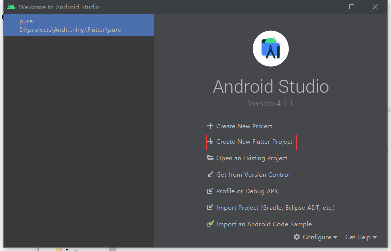

一个纯Flutter项目。

## 开发环境

Android Studio-4.1.1

Flutter-2.0.6

jdk-1.8

## 搭建过程

1. 打开Android Studio，使用菜单栏File->New->New Flutter Project..或者在Welcome页面上使用Create New Flutter Project来创建。

   ```
   
   ```

2. 

