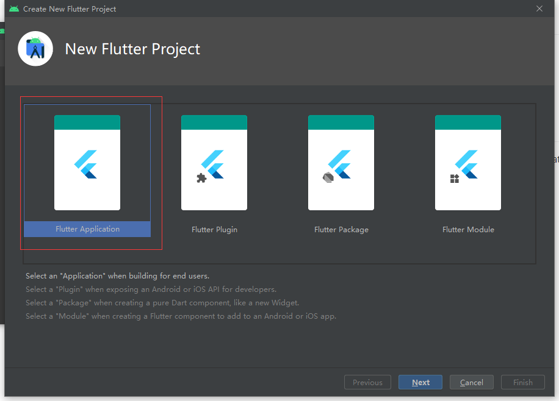
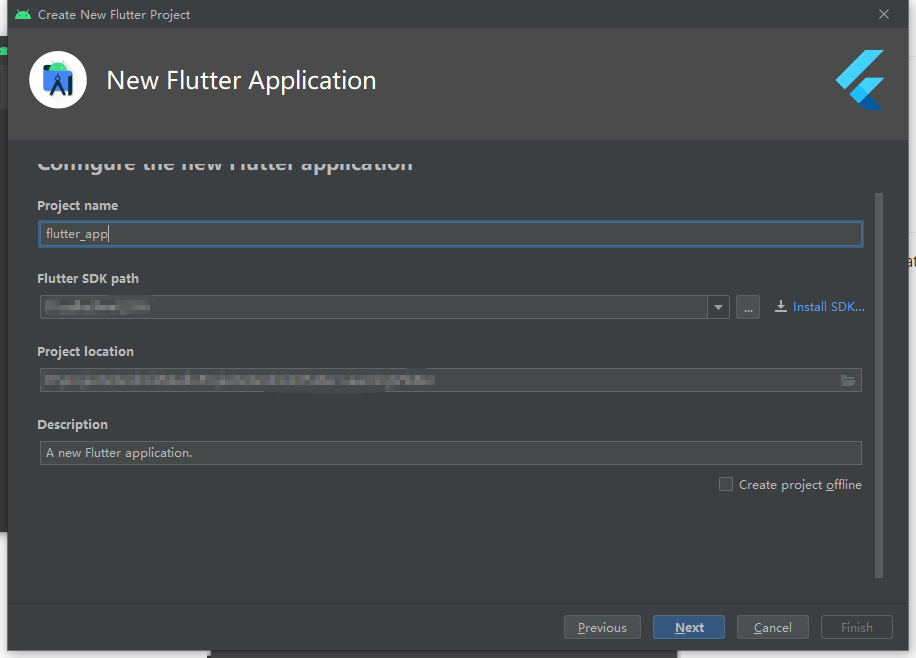
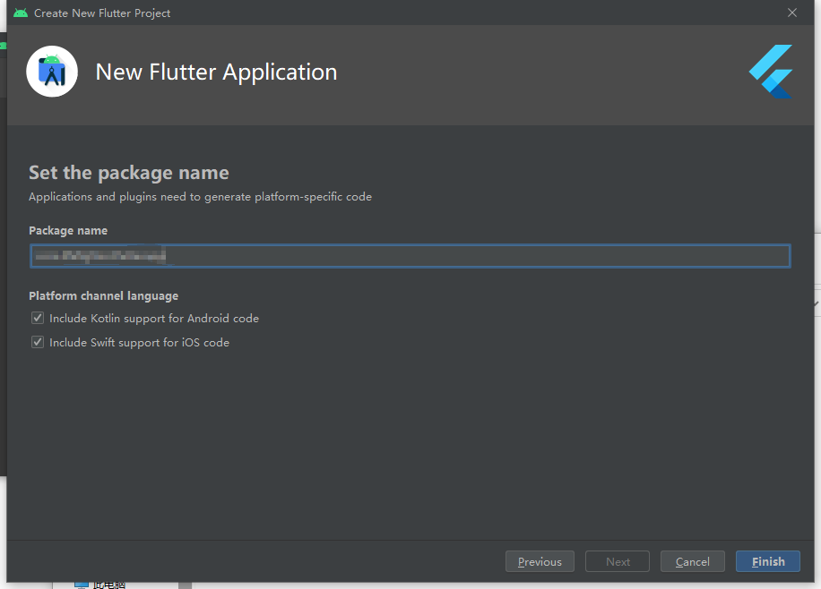

一个纯Flutter项目。

## 开发环境

Android Studio-4.1.1

Flutter-2.0.6

jdk-1.8

## 搭建过程

1. 打开Android Studio，使用菜单栏File->New->New Flutter Project..或者在Welcome页面上使用Create New Flutter Project来创建。

2. 打开创建窗口后，选择Flutter Applicaiton，然后点击Next即可。

3. 进入下一步后，填写项目名称，选择本地flutter sdk路径（或者通过install sdk），选择项目安装路径，最后填写项目描述后，就可以进入到下一步。

4. 进入下一步后，填写自己的包名，如果需要支持kotlin或者swift，则勾选support即可，最后点击Finish即可完成项目创建。

